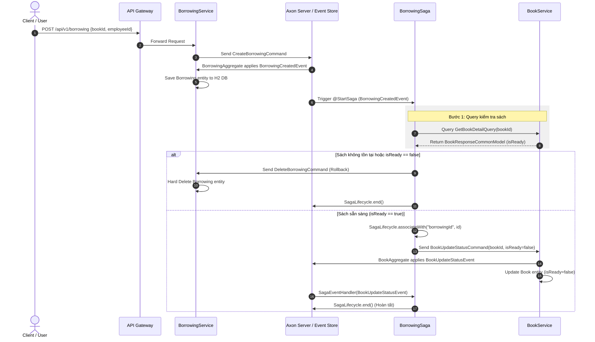
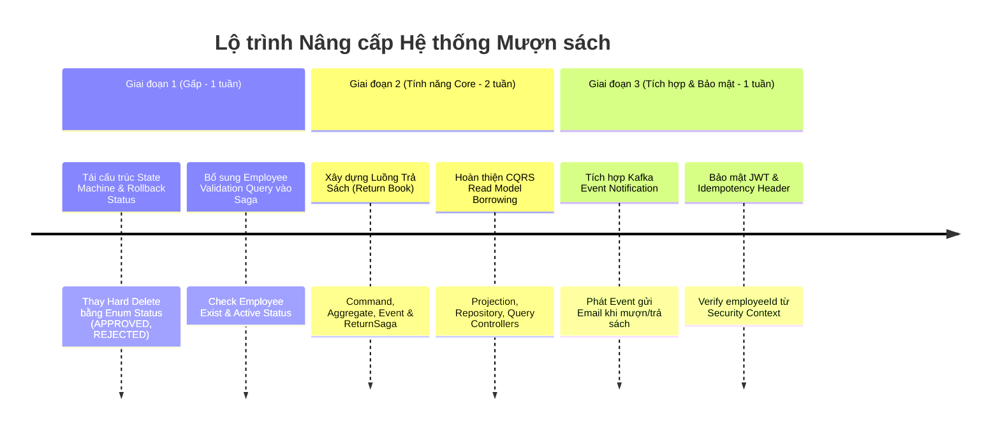

# BÁO CÁO RÀ SOÁT KIẾN TRÚC VÀ LOGIC NGHIỆP VỤ PHẦN MƯỢN SÁCH (BORROWING SERVICE)

**Người rà soát**: Senior Software Architect / Tech Lead (10+ năm kinh nghiệm)  
**Ngày rà soát**: 11/08/2026  
**Dự án**: Hệ thống Quản lý Thư viện Microservices (Spring Boot, Axon Framework - Event Sourcing & CQRS, Kafka, Eureka)  
**Phạm vi rà soát**: `borrowservice`, `bookservice`, `employeeservice`, `commonservice`, `notificationservice`

---

## 1. TỔNG QUAN HỆ THỐNG & ĐÁNH GIÁ TỔNG THỂ

Hệ thống mượn sách được thiết kế theo kiến trúc **Microservices** áp dụng mẫu **CQRS (Command Query Responsibility Segregation)** và **Event Sourcing** với **Axon Framework**, kết hợp **Saga Pattern (`BorrowingSaga`)** để quản lý các giao dịch phân tán (Distributed Transactions) giữa các dịch vụ.

### Đánh giá định lượng
| Tiêu chí | Điểm | Nhận xét nhanh |
| :--- | :---: | :--- |
| **Kiến trúc CQRS & Saga** | **7.5/10** | Đã triển khai chuẩn Saga Orchestration với Axon. Đã xử lý exception handling để tránh đứt gãy TrackingEventProcessor token. |
| **Tính đầy đủ Nghiệp vụ (Domain Rules)** | **4.0/10** | Mới dừng ở mức POC (Proof of Concept). **Thiếu hoàn toàn luồng Trả sách (Return Book)** và **Thiếu kiểm tra Nhân viên (Employee Validation)**. |
| **Toàn vẹn Dữ liệu (Data Consistency & Compensating)** | **6.0/10** | Dùng Hard Delete khi Rollback (xóa record `Borrowing` thay vì cập nhật trạng thái `REJECTED`/`CANCELLED`). |
| **Bảo mật & Tích hợp (Security & Integration)** | **5.0/10** | Chưa verified `employeeId` từ JWT Token; chưa kết nối `NotificationService` qua Kafka sau khi mượn thành công. |
| **Tổng thể (Overall)** | **5.6/10** | **Cần tái cấu trúc (Refactoring) trước khi đưa vào sản xuất (Production Ready).** |

---

## 2. SƠ ĐỒ LUỒNG THỰC THI SAGA HIỆN TẠI (SEQUENCE DIAGRAM)



---

## 3. RÀ SOÁT CHI TIẾT & PHÂN TÍCH LỖI / RỦI RO (FINDINGS & RISKS)

### 3.1. Luồng Khởi Tạo & Quản Lý Giao Dịch Phân Tán (Saga & Commands)

####  Điểm tốt (Strengths)
1. **Cô lập Processing Group & Khắc phục Token Stuck Loop**:
   - Class `BorrowingSaga` đã được cấu hình `@ProcessingGroup("borrowing-saga")`.
   - Trong `handle(BorrowingCreatedEvent event)`, toàn bộ ngoại lệ đã được bọc trong khối `try-catch` và gọi `rollbackBorrowingRecord(event.getId())`. Điều này ngăn ngừa hiện tượng exception thoát ra ngoài làm `TrackingEventProcessor` release token claim và rơi vào vòng lặp retry vô tận mỗi 60 giây.
2. **Khóa chống Race Condition (TOCTOU - Time of Check to Time of Use)**:
   - Tại `BookAggregate.java` (dòng 78-84), đã có đoạn code guard check:
     ```java
     if (Boolean.FALSE.equals(command.getIsReady()) && Boolean.FALSE.equals(this.isReady)) {
         throw new IllegalStateException("Sách '" + this.id + "' đã có người mượn...");
     }
     ```
   - Axon đảm bảo các command đến cùng 1 Aggregate Identifier (`bookId`) sẽ được xử lý đơn luồng/tuần tự (serialized execution), loại bỏ hoàn toàn khả năng 2 người mượn cùng 1 cuốn sách tại một thời điểm.
3. **Đăng ký Association Key đúng thời điểm**:
   - Gọi `SagaLifecycle.associateWith("borrowingId", event.getId())` trước khi gửi `BookUpdateStatusCommand` giúp Saga bắt đúng `BookUpdateStatusEvent` phản hồi từ `BookService`.

#### ⚠️ Nhược điểm & Lỗi Kiến trúc (Architecture Issues & Code Smells)

1. **Anti-Pattern: Rollback bằng Hard Delete (`DeleteBorrowingCommand`)**
   - **Hiện trạng**: Trong `rollbackBorrowingRecord`, hệ thống gửi `DeleteBorrowingCommand` để xóa hẳn dòng record trong bảng `borrowing` (`borrowingRepository.delete(borrowing)`).
   - **Tác hại**: Trong Event Sourcing và Hệ thống Tài chính/Quản lý:
     - Việc xóa sạch dữ liệu khỏi Read DB làm mất khả năng **Audit Log** (Không biết ai đã từng gửi yêu cầu mượn thất bại và lý do tại sao).
     - Nếu Event Store lưu `BorrowingCreatedEvent` và `BorrowingDeleteEvent`, dữ liệu giữa Write Model (Event Store) và Read Model (JPA DB) bị bất tương đồng về mặt ý nghĩa domain.
   - **Giải pháp**: Thêm thuộc tính `status` (`PENDING`, `APPROVED`, `REJECTED`, `RETURNED`, `CANCELLED`). Khi rollback, phát `CancelBorrowingCommand` để update status thành `REJECTED` hoặc `CANCELLED`.

2. **Eventual Consistency Latency tại bước Query Sách**
   - **Hiện trạng**: Trong Saga, bước đầu tiên gọi `GetBookDetailQuery` đến `BookProjection` (đọc từ MySQL/H2 Read Database).
   - **Tác hại**: Read Database của `BookService` được cập nhật bất đồng bộ qua `@EventHandler`. Nếu Read DB bị chậm (lag/delay), Saga có thể đọc sai trạng thái `isReady` cũ. Dù đã có Guard Check tại `BookAggregate`, việc Query Read DB ở Saga tạo ra độ trễ không cần thiết và có nguy cơ trả về thông tin stale.

3. **Thiếu Idempotency Control tại Rest Controller**
   - **Hiện trạng**: `BorrowingCommandController` sinh UUID mới trên mỗi request:
     ```java
     CreateBorrowingCommand command = new CreateBorrowingCommand(UUID.randomUUID().toString(), model.getBookId(), model.getEmployeeId(), new Date());
     ```
   - **Tác hại**: Nếu phía Frontend/Client bị timeout hoặc chập chờn mạng và nhấn submit 2 lần, 2 `borrowingId` khác nhau sẽ được tạo ra, gây ra 2 giao dịch mượn độc lập.

---

### 3.2. Sự Thiếu Hụt Nghiệp Vụ Domain (Missing Core Business Features)

1. ** THIẾU HOÀN TOÀN LUỒNG TRẢ SÁCH (RETURN BOOK FLOW)**
   - **Hiện trạng**: Trong bảng `Borrowing` và `BorrowingAggregate` có thuộc tính `private Date returnDate;`. Tuy nhiên:
     - Không có Controller API `/api/v1/borrowing/return` hoặc `/api/v1/borrowing/{id}/return`.
     - Không có `ReturnBookCommand`, `BookReturnedEvent` hay Saga trả sách.
   - **Hệ quả**: Một khi sách đã mượn (`isReady = false`), nó **vĩnh viễn bị khóa ở trạng thái `false`** và không bao giờ có thể được mượn lại bởi bất kỳ ai khác!

2. ** THIẾU KIỂM TRA ĐIỀU KIỆN NHÂN VIÊN (EMPLOYEE VALIDATION)**
   - **Hiện trạng**: Saga mượn sách hiện tại chỉ check sách có `isReady == true` hay không, hoàn toàn **bỏ qua `employeeId`**.
   - **Các quy tắc nghiệp vụ bị bỏ qua**:
     - Nhân viên có tồn tại trong hệ thống (`EmployeeService`) không?
     - Tài khoản nhân viên có đang bị khóa/đình chỉ công tác không?
     - Nhân viên có đang vi phạm giữ sách quá hạn (Overdue) chưa trả không?
     - Nhân viên có vượt quá số lượng sách mượn tối đa cho phép (ví dụ: tối đa 3-5 cuốn) không?
   - **Hệ quả**: Bất kỳ ai gửi một chuỗi `employeeId` ngẫu nhiên (hoặc không tồn tại) vẫn mượn được sách thành công.

3. ** CHƯA PHÁT TRIỂN QUERIES/PROJECTIONS PHÍA BORROWING SERVICE**
   - **Hiện trạng**: Thư mục `borrowservice/src/main/java/com/example/borrowservice/query` hoàn toàn trống (`controller`, `model`, `projection`, `queries`).
   - **Hệ quả**: Người dùng hoặc Quản trị viên không thể gọi API để tra cứu:
     - Danh sách các sách mà nhân viên X đang mượn.
     - Lịch sử mượn trả sách của thư viện.
     - Danh sách phiếu mượn sắp đến hạn hoặc đã quá hạn.

---

### 3.3. Tích Hợp Thông Báo & Bất Đồng Bộ (Kafka & Notification Service)

- **Hiện trạng**: Dịch vụ `notificationservice` đã được viết và tích hợp Spring Kafka (`@KafkaListener`), hỗ trợ gửi Email mẫu qua `EmailService`. Tuy nhiên, `borrowservice` **chưa từng gửi bất kỳ message nào lên Kafka** khi giao dịch mượn sách thành công hay thất bại.
- **Hệ quả**: Người mượn sách không nhận được Email xác nhận mượn sách thành công, ngày hẹn trả sách, hay thông báo khi mượn thất bại.

---

### 3.4. Bảo Mật, Cấu Hình Infrastructure & Code Cleanup

1. **Chưa xác thực Identity từ Security Token (JWT)**:
   - REST Controller lấy `employeeId` trực tiếp từ JSON Payload (`@RequestBody BorrowingCreateModel model`). Người dùng A có thể giả mạo nhập `employeeId` của người dùng B để mượn sách.
2. **Cấu hình Cơ sở dữ liệu In-Memory (H2)**:
   - `borrowservice/resources/application.properties` đang sử dụng `jdbc:h2:mem:borrowDB`. Mọi dữ liệu phiếu mượn bị xóa sạch mỗi khi restart service.
3. **Dead Code trong `bookservice`**:
   - File `com.example.bookservice.command.event.BookUpdateStatusEvent.java` bị đánh dấu `@Deprecated`. Cần hoàn tất dọn dẹp để tránh gây hiểu nhầm cho các lập trình viên khác trong team.

---

## 4. ĐỀ XUẤT GIẢI PHÁP VÀ LỘ TRÌNH NÂNG CẤP (RECOMMENDED ROADMAP)



---

## 5. MẪU THIẾT KẾ CẢI TIẾN CHI TIẾT (CODE REFACTORING BLUEPRINTS)

### 5.1. Bổ sung Status Enum & Refactor `BorrowingAggregate`

#### [NEW] `BorrowingStatus.java`
```java
package com.example.borrowservice.command.data;

public enum BorrowingStatus {
    PENDING,    // Đang xử lý Saga
    APPROVED,   // Mượn thành công
    REJECTED,   // Mượn thất bại (Sách đã mượn / NV bị khóa)
    RETURNED    // Đã trả sách
}
```

#### Refactor `BorrowingSaga.java` (Kiểm tra Nhân viên + Trạng thái Phân tán)

```java
@StartSaga
@SagaEventHandler(associationProperty = "id")
private void handle(BorrowingCreatedEvent event) {
    log.info("Saga started for borrowingId: {}", event.getId());
    try {
        // 1. Kiểm tra thông tin Nhân viên từ EmployeeService
        GetEmployeeDetailQuery getEmployeeQuery = new GetEmployeeDetailQuery(event.getEmployeeId());
        EmployeeResponseCommonModel employee = queryGateway
                .query(getEmployeeQuery, ResponseTypes.instanceOf(EmployeeResponseCommonModel.class))
                .get(10, TimeUnit.SECONDS);

        if (employee == null || Boolean.FALSE.equals(employee.getIsActive())) {
            log.warn("Saga rejected: Employee {} is invalid or inactive", event.getEmployeeId());
            rejectBorrowingRecord(event.getId(), "Nhân viên không hợp lệ hoặc đang bị khóa.");
            return;
        }

        // 2. Kiểm tra thông tin Sách từ BookService
        GetBookDetailQuery getBookDetailQuery = new GetBookDetailQuery(event.getBookId());
        BookResponseCommonModel book = queryGateway
                .query(getBookDetailQuery, ResponseTypes.instanceOf(BookResponseCommonModel.class))
                .get(10, TimeUnit.SECONDS);

        if (book == null || Boolean.FALSE.equals(book.getIsReady())) {
            log.warn("Saga rejected: Book {} is not ready", event.getBookId());
            rejectBorrowingRecord(event.getId(), "Sách đã có người mượn hoặc không tồn tại.");
            return;
        }

        // 3. Đăng ký Association Key & gửi Command cập nhật trạng thái Sách
        SagaLifecycle.associateWith("borrowingId", event.getId());
        BookUpdateStatusCommand command = new BookUpdateStatusCommand(
                event.getBookId(), false, event.getEmployeeId(), event.getId()
        );
        commandGateway.sendAndWait(command, 15, TimeUnit.SECONDS);

    } catch (Exception e) {
        log.error("Saga execution failed for borrowingId={}: {}", event.getId(), e.getMessage());
        rejectBorrowingRecord(event.getId(), e.getMessage());
    }
}
```

---

### 5.2. Mẫu thiết kế Luồng Trả Sách (Return Book Flow)

Để hoàn thiện nghiệp vụ, hệ thống cần bổ sung các thành phần:

1. **`ReturnBorrowingCommand`**:
   - Input: `borrowingId`, `returnDate`.
2. **`BorrowingReturnedEvent`**:
   - Trực tiếp cập nhật `returnDate` và `status = RETURNED` tại `BorrowingAggregate`.
3. **`ReturnBookSaga` hoặc Command trực tiếp**:
   - Gửi `BookUpdateStatusCommand(bookId, isReady = true)` để mở lại sách cho người khác mượn.

---

## 6. KẾT LUẬN & ĐỀ XUẤT THỰC THI

Kiến trúc hiện tại của hệ thống đã đặt nền móng rất tốt với **Axon Framework, CQRS và Saga Pattern**. Các vấn đề liên quan đến concurrency điều khiển trạng thái sách và exception handling trong Saga đã được xử lý đúng định hướng.

tuy nhiên, để ứng dụng đạt chuẩn **Enterprise / Production Ready**, nhóm phát triển cần ưu tiên:
1. **Chuyển đổi chiến lược Rollback** từ Hard Delete sang Status-based State Machine.
2. **Bổ sung luồng Trả sách (Return Book)** và **Kiểm tra điều kiện Nhân viên (Employee Validation)**.
3. **Bổ sung Read Projections** cho `borrowservice` và kết nối **Kafka Notification Event**.

---
*Báo cáo được khởi tạo tự động phục vụ công tác Rà soát Kiến trúc & Code Quality Audit.*
